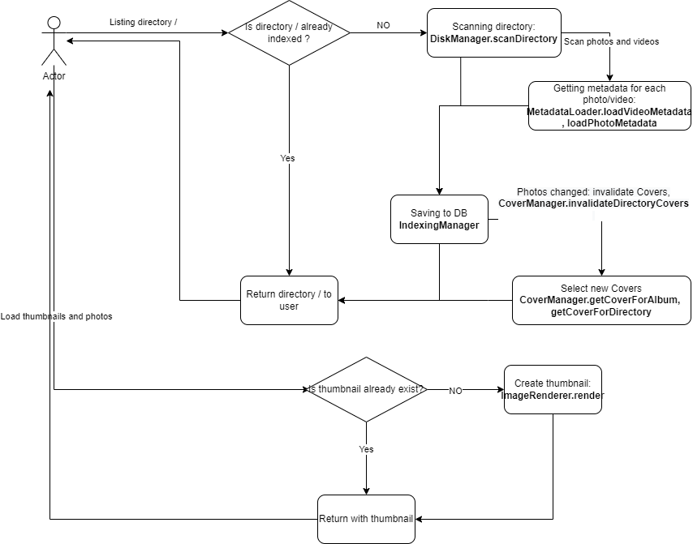

# pigallery2 Extension

See feature issue for more information: [#743](https://github.com/bpatrik/pigallery2/issues/743).

See sample extension at https://github.com/bpatrik/pigallery2-sample-extension.

# Extension Usage

Extension folder can be set through config. For the docker-ised version,
they live under the `config/extension` folder in their own subdirectory.

# Extension development

## Minimal setup

You need at least a `server.js` in your extension folder that exports a `init(ext) {}` function.

## Recommended setup

```
<path to the extension fodler>/myextension/package.js <- this is optional. You can add extra npm packages here
<path to the extension fodler>/myextension/server.js <- this is needed
```

Where `<path to the extension fodler>` is what you set in the config and `myextension` is the name of your extension.
Note: you do not need to add your `node_modules` folder. The app will call `npm install` when initializing your extension.

## Extension environment

The app runs the extension the following way:

- It reads all extensions in `<path to the extension fodler>/**` folder
- Checks if `package.js` is present. If yes installs the packages
- Checks if `server.js` is present. If yes, calls the `init` function.

### Init and cleanup lifecycle

There is also a `cleanUp` function that you can implement in your extension.
The app can call your `init` and `cleanUp` functions any time.
Always calls the `init` first then `cleanUp` later.
Main use-case: `init` is called on app startup. `cleanUp` and `init` called later when there is a new config change.

## Extension interface

The app calls the `init` and `cleanUp` function with a `IExtensionObject` object.
See https://github.com/bpatrik/pigallery2/blob/master/src/backend/model/extension/IExtension.ts for details.

`IExtensionObject` exposes lifecycle events, configs, RestAPis with some limitation.
Changes made during the these public apis you do not need to clean up in the `cleanUp` function.
App also exposes private `_app` object to provide access to low level API. Any changes made here needs clean up.

## server.js

See sample server.js at https://github.com/bpatrik/pigallery2-sample-extension.

It is recommended to do the development in `ts`, so creating a `server.ts`.
Note: You need to manually transpile your `server.ts` file to `server.js` as the app does not do that for you.
This doc assumes you do the development in `ts`.

### server.ts

You can import package from both the main app package.json and from your extension package.json.
To import packages from the main app, you import as usual.
For packages from the extension, you always need to write relative path. i.e.: prefix with `./node_modules`

```ts
// Including dev-kit interfaces. It is not necessary, only helps development with types.
// You need to prefix them with ./node_modules
import { IExtensionObject } from "./node_modules/pigallery2-extension-kit";

// Including prod extension packages. You need to prefix them with ./node_modules
// lodash does not have types
// eslint-disable-next-line @typescript-eslint/ban-ts-comment
// @ts-ignore
import * as _ from "./node_modules/lodash";

// Importing packages that are available in the main app (listed in the packages.json in pigallery2)
import { Column, Entity, Index, PrimaryGeneratedColumn } from "typeorm";
```

#### pigallery2 extension dev-kit

It is recommended to use the `pigallery2-extension-kit` node package.
`npm install pigallery2-extension-kit --save` to your extension.

`pigallery2-extension-kit` contains the type definitions and enums for the app.
This node package is basically includes the all definitions of the app and exports the `IExtensionObject` that the `init` function receives.

You can then `import {IExtensionObject} from './node_modules/pigallery2-extension-kit';`

See https://github.com/bpatrik/pigallery2/blob/master/src/backend/model/extension/IExtension.ts to understand what contains `IExtensionObject`.

NOTE: this is not needed to create an extension it only helps your IDE and your development. These type definitions are removed when you compile `ts` to `js`.

#### `init` function

You need to implement the `init` function for a working extension:

```ts
export const init = async (extension: IExtensionObject<void>): Promise<void> => {};
```

#### pigallery2 lifecycle `events`

Tha app exposes multiple interfaces for the extensions to interact with the main app. `events` are one of the main interfaces.
Here are their flow:


